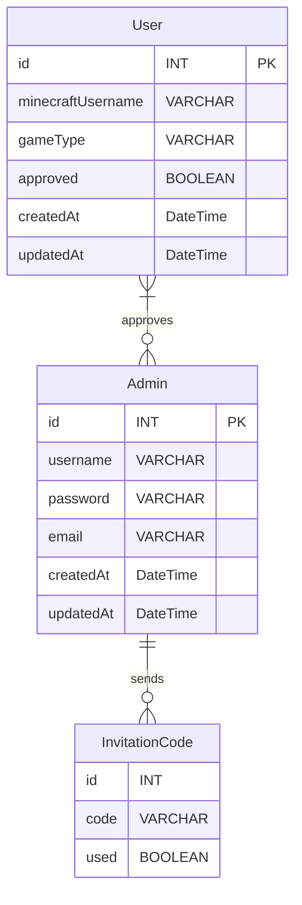

# Convenient Whitelist for Minecraft Servers Backend

This application allows admins and moderators to easily manage a whitelist for their Minecraft server.
The Backend provides an API to be used for CRUD operations. 

This is a Prisma, PostgreSQL, and Express application for users to register to a Minecraft server.
## Features

- User registration with Minecraft username
- Admin authentication
- Automatic Minecraft server whitelist management through RCON

## Database Entity Relationship Model



## Prerequisites

Before you begin, ensure you have met the following requirements:

- You have installed [Node.js](https://nodejs.org/) (14.x or later is recommended)
- You have an SQLite database available
- You have access to a Minecraft server with RCON enabled

## Installation

1. Navigate into the folder:
```bash
cd convitelist/backend
```

2. Install the dependencies:
```bash
npm install
```

3. Copy the `.env.example` file to `.env`:
```bash
cp .env.example .env
```

4. Update the `.env` file with your SQLite database URL, RCON credentials, and other configuration options.

5. Run the database migrations:
```bash
npx prisma migrate deploy
```
or
```bash
npx prisma migrate dev --name init    # for development to create a database
```

6. Generate the Prisma client:
```bash
npx prisma generate
```

7. Start the development server:
```bash
npm run dev
```

The application will be available at `http://localhost:3001`.

8. Build the application:
```bash
npm run build
```

9. Start the production server:
```bash
npm run start
```

## Admin Registration

### First Admin User

After setting up the application, you can register the first admin user directly through the web interface **without** needing an invitation code:

1. Navigate to the admin registration page (typically `/admin/register`)
2. Fill in the registration form with:
   - **Username**: Choose a unique username
   - **Password**: Must be at least 8 characters long
   - **Email**: Your email address
3. Click "Register" - no invitation code is required for the first admin

The system automatically detects when no admins exist and allows the first registration without an invitation code.

### Registering Additional Admin Users

For subsequent admin registrations, an invitation code is required for security:

1. **Generate an invitation code** (as an existing admin):
   - Log in to the admin panel
   - Use the invitation code generation endpoint: `POST /api/invitation/generate-invitation-code`
   - Or use the script: `node src/scripts/testInvitationCode.js`
   - Copy the generated code

2. **Register the new admin**:
   - Navigate to the admin registration page
   - Fill in the registration form with:
     - **Username**: Choose a unique username
     - **Password**: Must be at least 8 characters long
     - **Email**: The new admin's email address
     - **Invitation Code**: Enter the code generated in step 1
   - Click "Register"

Each invitation code can only be used once. After successful registration, the code is marked as used and cannot be reused.

## Deployment

The deployment process will depend on your chosen hosting provider. Please consult the provider's documentation for deploying Node.js applications and configuring environment variables.