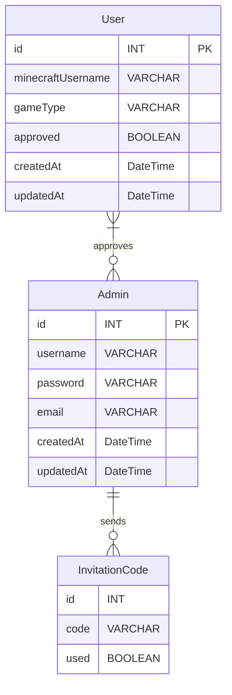

# Convenient Whitelist for Minecraft Servers Backend

This application allows admins and moderators to easily manage a whitelist for their Minecraft server.
The Backend provides an API to be used for CRUD operations. 

This is a Prisma, PostgreSQL, and Express application for users to register to a Minecraft server.
## Features

- User registration with Minecraft username
- Admin authentication
- Automatic Minecraft server whitelist management through RCON

## Database Entity Relationship Model



## Prerequisites

Before you begin, ensure you have met the following requirements:

- You have installed [Node.js](https://nodejs.org/) (14.x or later is recommended)
- You have an SQLite database available
- You have access to a Minecraft server with RCON enabled

## Installation

1. Navigate into the folder:
```bash
cd convitelist/backend
```

2. Install the dependencies:
```bash
npm install
```

3. Copy the `.env.example` file to `.env`:
```bash
cp .env.example .env
```

4. Update the `.env` file with your SQLite database URL, RCON credentials, and other configuration options.

5. Run the database migrations:
```bash
npx prisma migrate deploy
```
or
```bash
npx prisma migrate dev --name init    # for development to create a database
```

6. Generate the Prisma client:
```bash
npx prisma generate
```

7. Start the development server:
```bash
npm run dev
```

The application will be available at `http://localhost:3001`.

8. Build the application:
```bash
npm run build
```

9. Start the production server:
```bash
npm run start
```

## Admin Registration

### First Admin User

After setting up the application, you can register the first admin user directly through the web interface **without** needing an invitation code:

1. Navigate to the admin registration page (typically `/admin/register`)
2. Fill in the registration form with:
   - **Username**: Choose a unique username
   - **Password**: Must be at least 8 characters long
   - **Email**: Your email address
3. Click "Register" - no invitation code is required for the first admin

The system automatically detects when no admins exist and allows the first registration without an invitation code.

### Registering Additional Admin Users

For subsequent admin registrations, an invitation code is required for security:

1. **Generate an invitation code** (as an existing admin):
   - Log in to the admin panel
   - Use the invitation code generation endpoint: `POST /api/invitation/generate-invitation-code`
   - Or use the script: `node src/scripts/testInvitationCode.js`
   - Copy the generated code

2. **Register the new admin**:
   - Navigate to the admin registration page
   - Fill in the registration form with:
     - **Username**: Choose a unique username
     - **Password**: Must be at least 8 characters long
     - **Email**: The new admin's email address
     - **Invitation Code**: Enter the code generated in step 1
   - Click "Register"

Each invitation code can only be used once. After successful registration, the code is marked as used and cannot be reused.

## Security

### Critical Security Information

This application uses RCON (Remote Console) to communicate with your Minecraft server. **RCON is not encrypted by default** - it sends commands and passwords in plaintext over the network. Proper deployment architecture is essential for security.

### Recommended Deployment Architecture

**Deploy the backend on the same system as your Minecraft server.**

```
┌─────────────────────────────────────┐
│   Minecraft Server Host              │
│                                     │
│  ┌──────────────┐  ┌─────────────┐ │
│  │  Minecraft   │  │  Convitelist│ │
│  │  Server      │◄─┤  Backend    │ │
│  │  (RCON)      │  │             │ │
│  └──────────────┘  └─────────────┘ │
│         │                  │        │
│         └──────────────────┘        │
│            localhost only           │
└─────────────────────────────────────┘
         │
         │ HTTPS (public)
         ▼
┌─────────────────────────────────────┐
│   Web Server / Reverse Proxy        │
│   (Nginx, Cloudflare, etc.)          │
└─────────────────────────────────────┘
         │
         │ HTTPS
         ▼
┌─────────────────────────────────────┐
│   Convitelist Frontend              │
│   (Can be on separate host/CDN)      │
└─────────────────────────────────────┘
```

### Why Same-System Deployment is Recommended

1. **Network Isolation**: RCON traffic stays on `localhost` (127.0.0.1), never exposed to external networks
2. **Reduced Attack Surface**: No RCON traffic traverses untrusted networks
3. **Performance**: Lower latency for RCON commands
4. **Simplified Firewall Rules**: Only need to expose web ports (80/443), not RCON port (typically 25575)
5. **Security Principle**: Follows the principle of least privilege - RCON access is local-only

### Security Best Practices

#### 1. Environment Variables

**Critical**: Never commit secrets to version control.

- ✅ Use `.env` files (already in `.gitignore`)
- ✅ Generate strong random secrets (see `.env.example` for commands)
- ✅ Rotate secrets regularly
- ❌ Never use default/fallback secrets in production

#### 2. RCON Configuration

**Required Settings:**
```bash
# In your .env file on the Minecraft server host
MINECRAFT_RCON_HOST=127.0.0.1  # CRITICAL: localhost only!
MINECRAFT_RCON_PORT=25575
MINECRAFT_RCON_PASSWORD=<strong-random-password>
```

**RCON Password Requirements:**
- Minimum 16 characters
- Mix of uppercase, lowercase, numbers, symbols
- Unique from other passwords
- Generate with: `openssl rand -base64 24`

#### 3. Network Security

**Firewall Rules:**
- ✅ Allow inbound: 80 (HTTP), 443 (HTTPS)
- ❌ Block inbound: 25575 (RCON port) - should only be accessible locally
- ✅ Use fail2ban or similar for brute force protection
- ✅ Enable SSH key authentication only (disable password auth)

#### 4. Authentication & Authorization

**Current Protection:**
- ✅ RCON endpoints require admin authentication (`authMiddleware`)
- ✅ JWT tokens with expiration
- ✅ Rate limiting on API endpoints
- ✅ Input sanitization for RCON commands
- ✅ Command validation (whitelist only)

**Additional Recommendations:**
- Enable HTTPS (SSL/TLS) - see nginx.conf for configuration
- Regular security audits of admin accounts
- Log all RCON command executions

#### 5. Secret Generation

Generate secure secrets using:

```bash
# Generate JWT_SECRET
openssl rand -base64 32

# Generate SESSION_SECRET  
openssl rand -base64 32

# Generate RCON_PASSWORD
openssl rand -base64 24
```

### Security Checklist

Before deploying to production:

- [ ] Change all default secrets (JWT_SECRET, SESSION_SECRET, RCON_PASSWORD)
- [ ] Configure `MINECRAFT_RCON_HOST=127.0.0.1` (localhost)
- [ ] Set up HTTPS/SSL certificates
- [ ] Configure firewall rules (block RCON port from external access)
- [ ] Review and restrict admin account access
- [ ] Enable rate limiting
- [ ] Set up monitoring and logging
- [ ] Test RCON connection locally
- [ ] Verify authentication is working
- [ ] Review Docker security settings
- [ ] Set up regular backups

### Alternative: Separate Systems (NOT Recommended)

If you must deploy on separate systems:
- Use a VPN between backend and Minecraft server
- Configure firewall to only allow RCON from backend IP
- Consider SSH tunneling for RCON traffic
- Use strong, unique RCON passwords
- Monitor for unauthorized access attempts

### Incident Response

If you suspect a security breach:

1. **Immediately** change all passwords (RCON, admin accounts, JWT_SECRET, SESSION_SECRET)
2. Review access logs for suspicious activity
3. Check for unauthorized RCON commands
4. Review admin account activity
5. Rotate all secrets
6. Consider temporarily disabling the application until investigation is complete

For more detailed security information, see `../SECURITY.md` in the project root.

## Deployment

The deployment process will depend on your chosen hosting provider. Please consult the provider's documentation for deploying Node.js applications and configuring environment variables.

**Important**: Follow the security guidelines above, especially regarding RCON configuration and same-system deployment.